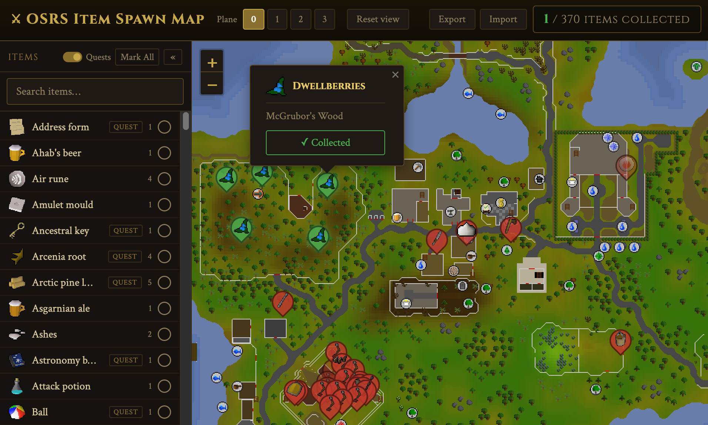

# OSRS Item Spawn Map

Interactive map of OSRS (Old School RuneScape) item spawns, generated from the [OSRS Wiki / Item_spawn](https://oldschool.runescape.wiki/w/Item_spawn).

- https://osrs-item-spawn-map.app



Tracks collected items (saved in `localStorage`). Export/Import support.

| Path        | Role                                              |
| ----------- | ------------------------------------------------- |
| `scraper/`  | Python scraper → `data/spawn_items.json` + icons  |
| `frontend/` | Vite + Leaflet SPA (Cloudflare Pages)             |
| `worker/`   | Tile proxy + tile-version API (Cloudflare Worker) |
| `shared/`   | Shared TS constants (fallback tile version)       |
| `schemas/`  | Shared JSON Schema for spawn data                 |

## Architecture

Scraper: Python CLI that crawls the wiki item spawn list, resolves coordinates and item metadata, downloads item icons into `data/icons/`, and writes `data/spawn_items.json`. A local request cache at `data/cache.json` speeds up re-runs.

Frontend: TypeScript SPA (Vite + Leaflet). Loads spawn data and bundled icons, renders markers by plane/map, and persists collected items in `localStorage`. In dev, Vite serves spawn JSON and icons from `data/` and proxies worker routes to `:8787`.

Worker: Cloudflare Worker that proxies wiki map tiles (CORS + rate limiting) and exposes `/api/tile-version` so the frontend can pick the correct tile set. Tile versions are cached in KV. The frontend and worker share a fallback tile version constant from `shared/tileVersion.ts`.

In production, Cloudflare Pages hosts the static frontend (with spawn JSON and icons embedded in `dist/`) and the Worker runs at `VITE_WORKER_URL`.

## Development

### Prerequisites

- Node.js 22
- pnpm 11
- uv (Python 3.11)

```bash
pnpm install
uv sync
pnpm dev
```

Refresh spawn data if needed:

```bash
uv sync
uv run python -m osrs_spawn_scraper --output data/spawn_items.json --cache data/cache.json
```

### Testing

Run everything from the repo root (matches CI):

```bash
pnpm check        # format, lint, test, build, Python ruff + ty + pytest
```

Individually:

```bash
pnpm test              # frontend + worker (vitest)
pnpm check:scraper     # ruff + pytest
pnpm test:scraper      # pytest only
pnpm check:spawn-data  # schema validation + overlapping-coord warnings
cd frontend && pnpm test
cd worker && pnpm test
uv run pytest          # scraper tests from repo root
```

Fix formatting/lint locally:

```bash
pnpm format:write      # JS/TS
pnpm lint:write        # JS/TS
uv run ruff check      # Python
uv run ty check        # Python
```

CI runs `pnpm check` on pull requests and pushes to `main`.

## Attribution and licensing

- Spawn data and bundled item icons: derived from the [OSRS Wiki](https://oldschool.runescape.wiki/) ([CC BY-NC-SA 3.0](https://creativecommons.org/licenses/by-nc-sa/3.0/)). See [data/DATA_LICENSE.md](data/DATA_LICENSE.md).
- Map tiles: © [RuneScape Wiki Maps](https://maps.runescape.wiki/), proxied at runtime with attribution.
- Game imagery: Created using intellectual property belonging to Jagex Limited under [Jagex's Fan Content Policy](https://legal.jagex.com/docs/policies/fan-content-policy). Not endorsed by or affiliated with Jagex or Weird Gloop.

## License

Application source code: [MIT](LICENSE.md).
